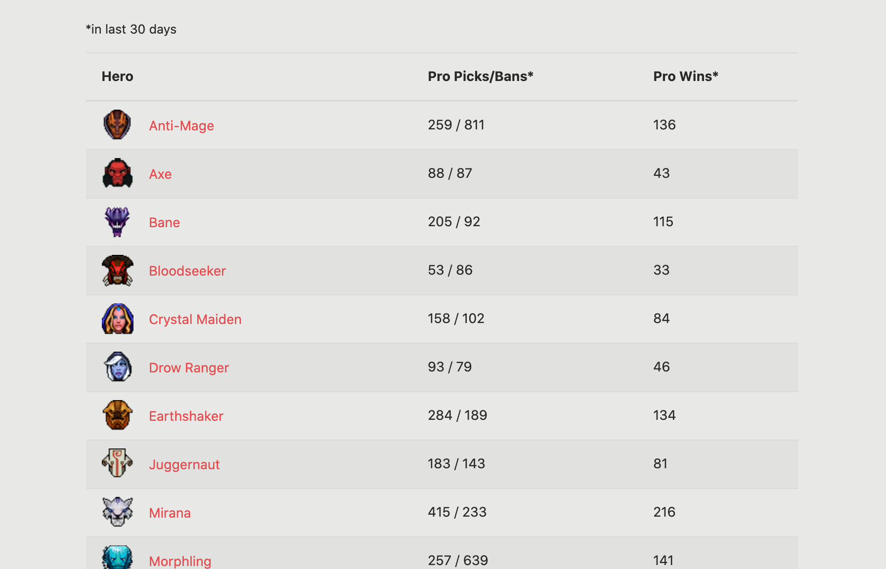
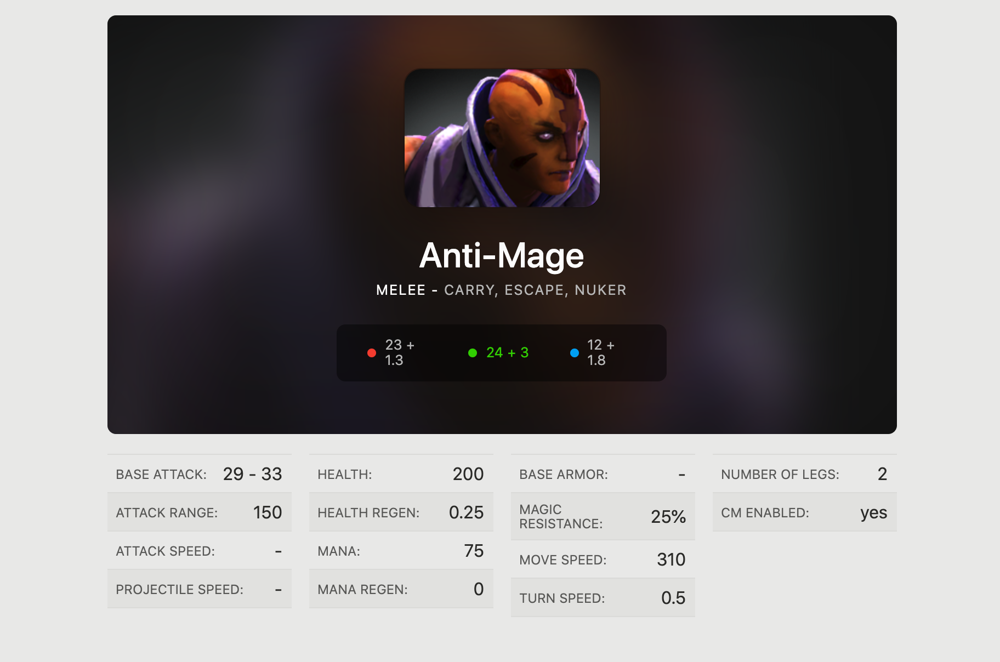

# SOLID engineer ReactJS assessment (Level Junior)


### This document is a test statement providing necessary information to assess the Candidate's coding requirements for a developer role at SOLID engineer.

1. **How to use:** Please `fork` the repo and make changes following below instructions.

2. **Before you start:**
- The React.js source is already connected to the sample API. https://api.opendota.com declared in `.env` file

  - [Hero stats documents](https://docs.opendota.com/#tag/hero-stats%2Fpaths%2F~1heroStats%2Fget)

1. **Requirement:**
- Create a "DOTA2 Heroes info" Web App which allows the user to see the list of Heroes, detail info about a hero.

- At detail:
  - Click on the `Heroes` menu item should show the listing of all heroes.
  - Click on a specific Hero should display this Hero infomation

- `Create/Update/Delete` functions are `NOT` needed, just get all Heroes AND display them.


  **DEMO SCREEN SHOTS**

<div align="center">

  
  *hero list page*

  </div>

  <div align="center">

  
  *hero detail page*

  </div>


### Feel free to custom & display your page, before images are just a demo for easily imagine

## Get Started

A Node.js 8.0.0+ setup with [yarn](https://yarnpkg.com/) is recommended.

```bash
# install dependencies
yarn

# ...or if you'd like to use npm instead
npm install

# serve with hot reload at localhost:3000
yarn start

# build for production
yarn build
```


Example heroes stats api response
```javascript
[
  {
        "id": 1,
        "name": "npc_dota_hero_antimage",
        "localized_name": "Anti-Mage",
        "primary_attr": "agi",
        "attack_type": "Melee",
        "roles": [
            "Carry",
            "Escape",
            "Nuker"
        ],
        "img": "/apps/dota2/images/heroes/antimage_full.png?",
        "icon": "/apps/dota2/images/heroes/antimage_icon.png",
        "base_health": 200,
        "base_health_regen": 0.25,
        "base_mana": 75,
        "base_mana_regen": 0,
        "base_armor": -1,
        "base_mr": 25,
        "base_attack_min": 29,
        "base_attack_max": 33,
        "base_str": 23,
        "base_agi": 24,
        "base_int": 12,
        "str_gain": 1.3,
        "agi_gain": 3,
        "int_gain": 1.8,
        "attack_range": 150,
        "projectile_speed": 0,
        "attack_rate": 1.4,
        "move_speed": 310,
        "turn_rate": 0.5,
        "cm_enabled": true,
        "legs": 2,
        "pro_ban": 808,
        "hero_id": 1,
        "pro_win": 135,
        "pro_pick": 259,
        "1_pick": 15541,
        "1_win": 8040,
        "2_pick": 36511,
        "2_win": 19412,
        "3_pick": 55515,
        "3_win": 29630,
        "4_pick": 60916,
        "4_win": 32402,
        "5_pick": 44470,
        "5_win": 23456,
        "6_pick": 21222,
        "6_win": 11132,
        "7_pick": 9325,
        "7_win": 4912,
        "8_pick": 2247,
        "8_win": 1127,
        "null_pick": 2501360,
        "null_win": 0
    },
]
```


# Expected output
- A video or screenshots showing a web app running on your localhost
- The web app source code (your github repo you forked)
- A 5-minutes call to explain how you built this web app.

### Total time of this exercise: **maximum 5 hour in 1 day**


